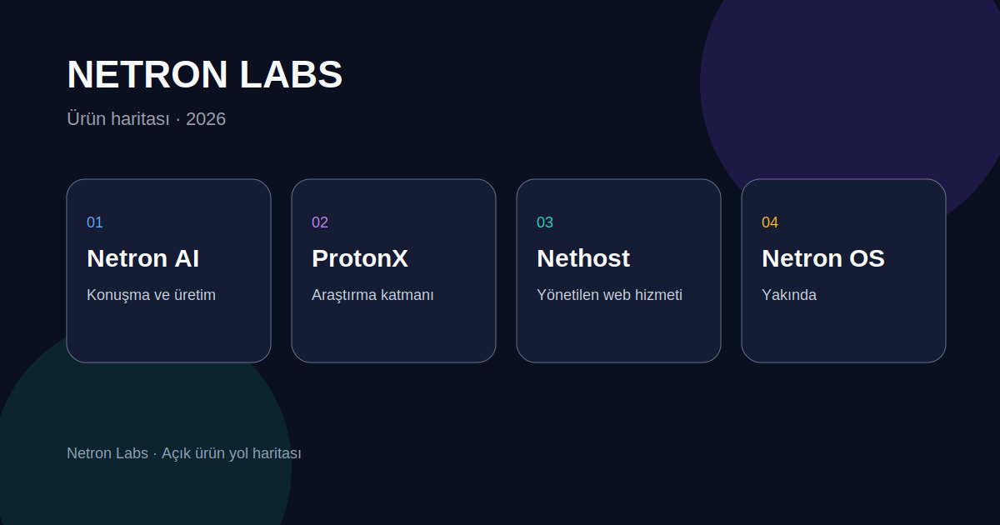
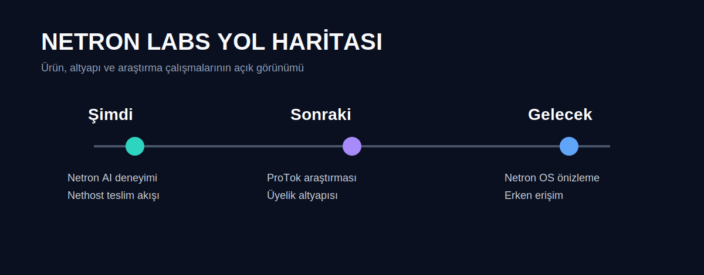
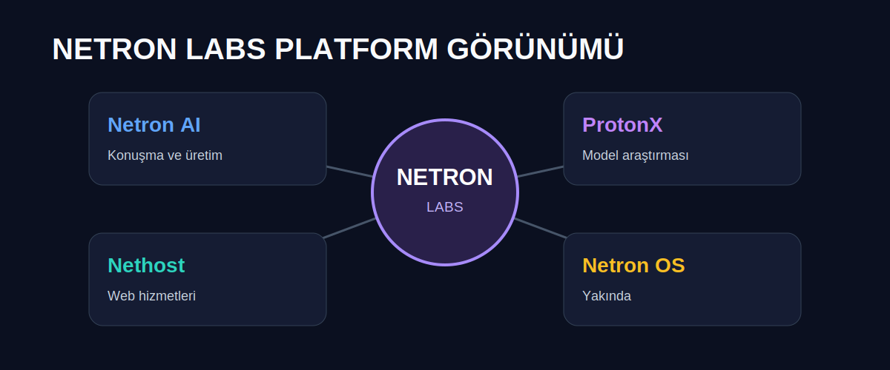

# Netron Labs

> Yapay zeka destekli dijital ürünler için Türkiye merkezli bağımsız ürün ve araştırma stüdyosu.

Netron Labs; konuşma tabanlı AI deneyimleri, web servisleri ve gelecekteki cihaz yazılımları üzerinde çalışan bir ürün laboratuvarıdır. Bu depo, ürünlerimizin genel haritasını ve herkese açık yol haritamızı bir araya getirir.

[Web sitesi](https://netron.net.tr) · [WhatsApp ile iletişim](https://wa.me/905545683634) · [Instagram](https://www.instagram.com/netron_ai_net/)

## Ürün Haritası

| Ürün | Durum | Odak |
| --- | --- | --- |
| **Netron AI** | Geliştirme | Konuşma, üretim ve plan tabanlı AI deneyimi |
| **ProtonX** | Araştırma | Türkçe odaklı model ve ProTok tokenizer araştırması |
| **Nethost** | Açık | İşletmeler için yönetilen web sitesi hizmeti |
| **Netron OS** | Yakında | Akıllı masaüstü deneyimi konsepti |

## Yol Haritası

### Şimdi
- Netron Labs kimliğini ve ürün deneyimini güçlendirmek
- Netron AI için güvenilir sohbet altyapısı geliştirmek
- Nethost talep ve teslim süreçlerini iyileştirmek

### Sonraki Aşama
- ProTok tokenizer araştırma sürümü
- ProtonX için Türkçe değerlendirme setleri
- Üyelik, kota ve kullanıcı yönetimi altyapısı

### Gelecek
- Netron OS önizlemesi
- Geliştirici araçları ve açık iş birlikleri
- Seçili erken erişim programları

## Platform Görünümü

## Çalışma İlkeleri

- Türkçe kullanıcı deneyimini ilk sıraya koymak
- Güvenli, ölçülü ve anlaşılır yapay zeka kullanımı
- Açık ürün yol haritası ve düzenli iyileştirme
- Küçük ekiplerle hızlı deney, ölçüm ve öğrenme

## İletişim

Startup programları, iş birlikleri, ürün pilotları veya Nethost talepleri için:

- E-posta: [netronainet@gmail.com](mailto:netronainet@gmail.com)
- WhatsApp: [0554 568 36 34](https://wa.me/905545683634)
- Web: [netron.net.tr](https://netron.net.tr)

---

© 2026 Netron Labs.
